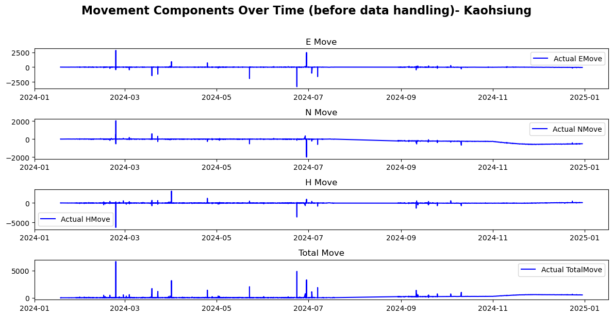
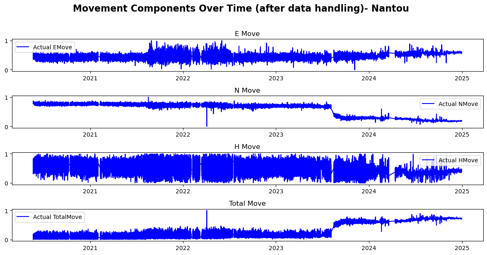

# Slope-Detection-Taiwan

## Table of Contents
- [Introduction](#introduction)
- [Dataset Overview](#dataset-overview)
- [Dataset EDA](#dataset-eda)
- [Data Preprocessing](#data-preprocessing)
- [Pipeline](#pipeline)
- [Models Implemented](#models-implemented)
- [Evaluation](#evaluation)
- [Experimental Record](#experimental-record)
- [License](#license)
- [Contributors](#contributors)

## Introduction
The **Slope-Detection-Taiwan** project is aimed to build a machine learning model that predicts the movements of the slopes in different areas of Taiwan. 
Key characteristics of the dataset include:
- date_time
- E, H, N
- E_Move, H_Move, N_Move

## Dataset Overview
All details of the datas are in [README_Dataset.md](Data\README_Dataset.md)

We only use the first data from each city:
- Kaohsiung/g2.csv
- Nantou/cn01.csv
- Taipei/h23-g1.csv

## Dataset EDA
(with and without Handling Outlier Values)

Kaohsiung/g2 

Nantou/cn01

Taipei/h23-g1

## Data Preprocessing  
1. **Step 1: Choosing Relevent Columns** 
    - Getting target columns and features columns.

2. **Step 2: Handling Outlier Values**
    - Remove values outside 3 standard deviations.

3. **Step 3: Scalling Data**
    - Applied `MinMaxScaler` to normalize the target columns.

## Pipeline

## Models Implemented  

### Machine Learning Models

- **Decision Trees and Ensemble Models**:  
  - XGBoost  
  - Random Forest  

### Deep Learning Models
  - GRU

## Evaluation
We use `MAE` and `RMSE` score as our performance metric.

  

## Experimental Record
Taipei

Nantou

Kaohsiung

## License
This project is licensed under the MIT License - see the [LICENSE](LICENSE) file for details.

## Contributors

  

Made with [contrib.rocks](https://contrib.rocks).